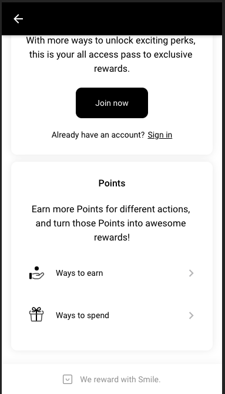

# Demo

## iOS Dashboard Access Options

### Dash Button Option
A dash button separate from the tab bar can be configured. To do so you will have to make sure you set `showFixedDashboardButton` to `true`, configure `fixedDashboardButtonUrlBlacklist`, configure your desired button style with `fixedDashboardButtonStyling`, and set `addLinksToMenu` to `false`.


#### Config:
```json
{
  "showFixedDashboardButton": true,
  "fixedDashboardButtonUrlBlacklist": [
    "/item/:productId/gallery/:slide",
    "/login"
  ],
    "fixedDashboardButtonStyling": {
    "bgColor": "#000000",
    "iconUrl": "https://cdn.sweettooth.io/v1/images/launcher_icons/bag.svg?color=",
    "iconColor": "#FFFFFF",
    "position": "right"
  },
  "addLinksToMenu": false
}
```

### Tab Bar Option
To configure a tab bar button for the smile dashboard you will have to make sure you set `showFixedDashboardButton` to `false`, and set `addLinksToMenu` to `true`.


#### Config:
```json
{
  "showFixedDashboardButton": false,
  "addLinksToMenu": true

}
```

## GMD Dashboard Access Options

### Dash Button Option
Similarly to the iOS theme options, you will have to make sure you set `showFixedDashboardButton` to `true`, configure `fixedDashboardButtonUrlBlacklist`, configure your desired button style with `fixedDashboardButtonStyling`, and set `addLinksToMenu` to `false`.


#### Config:
```json
{
  "showFixedDashboardButton": true,
  "fixedDashboardButtonUrlBlacklist": [
    "/item/:productId/gallery/:slide",
    "/login"
  ],
    "fixedDashboardButtonStyling": {
    "bgColor": "#000000",
    "iconUrl": "https://cdn.sweettooth.io/v1/images/launcher_icons/bag.svg?color=",
    "iconColor": "#FFFFFF",
    "position": "right"
  },
  "addLinksToMenu": false
}
```

### Tab Bar Option
Also similarly to the iOS theme, you will have to make sure you set `showFixedDashboardButton` to `false`, and set `addLinksToMenu` to `true`.


#### Config:
```json
{
  "showFixedDashboardButton": false,
  "addLinksToMenu": true

}
```

*Alternativey* you can configure the iOS and GMD themes to have both a fixed button and a button in the tab bar/nav drawer.

## Dashboard Views and Configurations

### Logged-Out Views

#### Main Dashboard Page
The logged out dashboard view utilizes the `colorConfig` and `loginPageText` configs.




#### Config:
```json
{
  "colorConfig": {
    "headerBackground": "black",
    "headerFontColor": "white",
    "buttonBackground": "black",
    "buttonFontColor": "white",
    "contentBackground": "white",
    "contentFontColor": "black",
    "mutedPointsColor": "#707070",
    "chevronColor": "BCBCBD",
    "dividerColor": "#F5F5F5"
  },
  "loginPageText": {
    "headerText": {
      "secondaryText": "Welcome To",
      "primaryText": "Merlin's magnificent magic shop"
    },
    "pointsText": {
      "header": "Points",
      "paragraph": "Earn more Points for different actions, and turn those Points into awesome rewards!"
    },
    "memberText": {
      "header": "Become a member",
      "paragraph": "With more ways to unlock exciting perks, this is your all access pass to exclusive rewards."
    }
  }
}
```

#### Ways To Earn Page
Merchant can configure`colorConfig`  and `loginPageText.headerText.primaryText` for the Ways To Earn Page. Ways to earn are fetched from Smile Api.


#### Config:
```json
{
  "colorConfig": {
    "headerBackground": "black",
    "headerFontColor": "white",
    "buttonBackground": "black",
    "buttonFontColor": "white",
    "contentBackground": "white",
    "contentFontColor": "black",
    "mutedPointsColor": "#707070",
    "chevronColor": "#BCBCBD",
    "dividerColor": "#F5F5F5"
  },
  "loginPageText": {
    "headerText": {
      "primaryText": "Merlin's magnificent magic shop"
    }
  }
}
```

#### Ways To Spend Page
Merchant can configure`colorConfig` configurations for Ways To Spend Page. Translations used on this page are `smile.points`, `smile.ways_to_spend`, and `smile.smile_error`. Ways to spend are fetched from Smile API.


#### Config:
```json
{
  "colorConfig": {
    "headerBackground": "black",
    "headerFontColor": "white",
    "buttonBackground": "black",
    "buttonFontColor": "white",
    "contentBackground": "white",
    "contentFontColor": "black",
    "mutedPointsColor": "#707070",
    "chevronColor": "#BCBCBD",
    "dividerColor": "#F5F5F5"
  }
}

### Logged-In Views

#### Main Dashboard Page
The logged in dashboard view utilizes the `colorConfig` configuration and API calls to Smile API.


#### Config:
```json
{
  "colorConfig": {
    "headerBackground": "black",
    "headerFontColor": "white",
    "buttonBackground": "black",
    "buttonFontColor": "white",
    "contentBackground": "white",
    "contentFontColor": "black",
    "mutedPointsColor": "#707070",
    "chevronColor": "#BCBCBD",
    "dividerColor": "#F5F5F5"
  }
}
```

#### Ways To Earn Page
Merchant can configure`colorConfig` configuration and this page use the `smile.points`, `smile.ways_to_earn`, and `smile.smile_error` translations. User points info, earned rewards, and to be earned rewards are fetched from smile API.


#### Config:
```json
{
  "colorConfig": {
    "headerBackground": "black",
    "headerFontColor": "white",
    "buttonBackground": "black",
    "buttonFontColor": "white",
    "contentBackground": "white",
    "contentFontColor": "black",
    "mutedPointsColor": "#707070",
    "chevronColor": "#BCBCBD",
    "dividerColor": "#F5F5F5"
  }
}
```

#### All Rewards Page
All rewards pages uses the same route as the Ways to spend route because they are very similar. Merchant can configure`colorConfig` configurations for All RewardsPage. Translations used on this page are `smile.points`, `smile.all_rewards` , `smile.smile_error`. Ways to spend are fetched from Smile API.


#### Config:
```json
{
  "colorConfig": {
    "headerBackground": "black",
    "headerFontColor": "white",
    "buttonBackground": "black",
    "buttonFontColor": "white",
    "contentBackground": "white",
    "contentFontColor": "black",
    "mutedPointsColor": "#707070",
    "chevronColor": "#BCBCBD",
    "dividerColor": "#F5F5F5"
  }
}
```

#### Your Rewards Page
With the `colorConfig` and `loginPageText.headerText.primaryText` you can configure this page to match the merchants desktop view. With a logged in customer we will take the Smile customer ID and fetch all rewards from the Smile API.


#### Config:
```json
{
  "colorConfig": {
    "headerBackground": "black",
    "headerFontColor": "white",
    "buttonBackground": "black",
    "buttonFontColor": "white",
    "contentBackground": "white",
    "contentFontColor": "black",
    "mutedPointsColor": "#707070",
    "chevronColor": "#BCBCBD",
    "dividerColor": "#F5F5F5"
  },
  "loginPageText": {
    "headerText": {
      "primaryText": "Merlin's magnificent magic shop"
    }
  }
}
```

#### Reward Info Page
This page will utitlize the `colorConfig` and `loginPageText.headerText.primaryText` configurations in order to take a selected reward ID and display a copyable coupon code.


#### Config:
```json
{
  "colorConfig": {
    "headerBackground": "black",
    "headerFontColor": "white",
    "buttonBackground": "black",
    "buttonFontColor": "white",
    "contentBackground": "white",
    "contentFontColor": "black",
    "mutedPointsColor": "#707070",
    "chevronColor": "#BCBCBD",
    "dividerColor": "#F5F5F5"
  },
  "loginPageText": {
    "headerText": {
      "primaryText": "Merlin's magnificent magic shop"
    }
  }
}
```